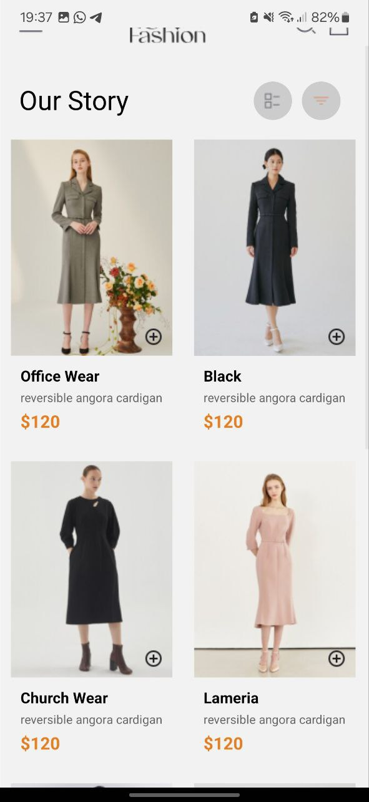
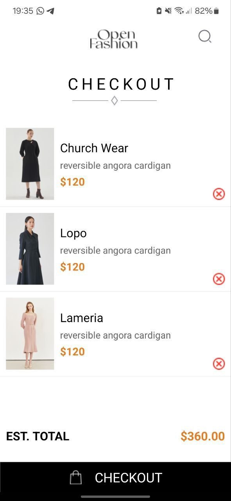

# ShoppingCartApp

This is a React Native application that allows users to view a list of available products, add products to their cart, remove products from their cart, and view the items in their cart. The selected items are stored locally on the device using AsyncStorage.

## Design Choices

## Components
1. *HomeScreen*: Displays a list of available products.
2. *CartScreen*: Displays selected items in the cart.
3. *ProductItem*: Represents a single product item with an "Add to Cart" button.
4. *CartItem*: Represents a single item in the cart with a "Remove from Cart" button.

## State Management
- **CheckoutContext**: A context provider that manages the global state of the cart. It includes functions to add and remove items from the cart and persists the cart data using AsyncStorage.

### Navigation
- *React Navigation*: Used to navigate between HomeScreen and CartScreen.
- *Drawer Navigation*: Provides a drawer-based navigation to switch between HomeScreen and CartScreen.

### Local Storage
- **AsyncStorage**: Used to store and retrieve cart data locally on the device. This ensures that the cart data persists even when the app is closed and reopened.

## Implementation Details

## Context for Global State
- Create a 'CheckoutContext' to manage the cart state.
- Use 'useState' to manage the cart items and 'useEffect' to load and save cart data using AsyncStorage.

## HomeScreen
- Display a list of available products using a 'FlatList'.
- Each product item includes an "Add to Cart" button which triggers a function to add the item to the cart using the context.

## CartScreen
- Display a list of selected items in the cart using a 'FlatList'.
- Each cart item includes a "Remove from Cart" button which triggers a function to remove the item from the cart using the context.

### Styling
- Use 'StyleSheet' for consistent styling across components.
- Ensure responsive design to handle different screen sizes.

## Screenshots

